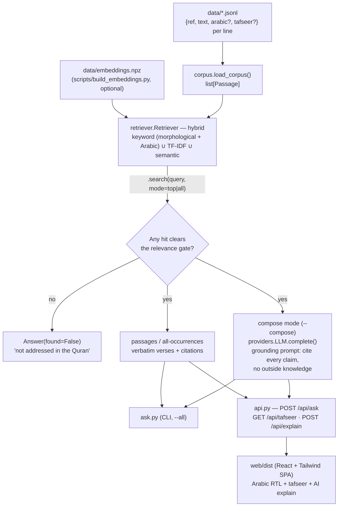

# Quran RAG

Answers questions strictly and only from the Quran, always with `[chapter:verse]` citations — and declines when a topic isn't in the text rather than guessing.


## What it does

Enter a topic and the system finds **every verse connected to it across the whole corpus** — shown in Arabic and English with `[chapter:verse]` citations, the tafseer one click away. Search is hybrid, three layers deep:

- **keyword** — morphological word matching over the translation (and diacritic-insensitive matching over the Arabic for Arabic-script queries); this is what makes "every occurrence" exhaustive — a verse that literally contains the topic word is always found
- **TF-IDF** — 1-2 gram cosine similarity, offline, no downloads
- **semantic** *(optional)* — an NVIDIA embedding index over all verses catches conceptually-related verses that share no vocabulary with the query

Two retrieval modes: `top` (best k hits, the default for the CLI) and `all` (every hit corpus-wide, what the web UI uses). Answers are then either the **verses verbatim** (default, no LLM needed) or an **LLM-composed prose answer** under a strict grounding prompt (`--compose`).

A relevance gate sits in front of everything: if no verse clears any layer's threshold, the system says the topic isn't addressed instead of forcing a weak match or inventing an answer. The test suite (`tests/test_quran_rag.py`) directly asserts this guarantee — citations must be verbatim substrings of the corpus, and off-topic questions must be declined.

The repo ships with a **10-verse sample corpus** (`data/quran_sample.jsonl`) so it runs out of the box, plus a full 6,191-verse corpus with Arabic and tafseer (`data/quran_full.jsonl`); see [Add the full text](#add-the-full-text).

## Architecture



`providers.py` supplies the LLM backends behind a common interface — `MockLLM` (deterministic, used by tests — no network), `AnthropicLLM`, and `NvidiaLLM` (NIM chat completions) — plus `NvidiaEmbedder` for query-time embeddings. Neither the retriever nor the answerer knows which one it's talking to.

The TF-IDF matrix is rebuilt in-memory at startup; the semantic index is persisted (`data/embeddings.npz`, built once by `scripts/build_embeddings.py`) and loaded if its refs align 1:1 with the corpus — if the corpus changes, rebuild the index or the semantic layer silently disables itself.

## Quickstart

```bash
python -m venv .venv && source .venv/bin/activate   # Windows: .\.venv\Scripts\activate
pip install -e ".[dev]"

python ask.py "hardship and ease"
python ask.py "Musa" --data data/quran_full.jsonl --all   # every occurrence, Arabic + English
pytest -q   # 12 tests
```

Real output from the command above:

```
$ python ask.py "hardship and ease"
[94:6] Surely with that hardship comes more ease.

[94:5] So, surely with hardship comes ease.

Sources: 94:6, 94:5
```

```
$ python ask.py "how to configure a kubernetes cluster"
This topic does not appear to be addressed in the Quran.
```

Compose a grounded prose answer with an LLM (cites every verse):

```bash
pip install -e ".[anthropic]"
python ask.py "hardship and ease" --provider anthropic --api-key sk-ant-... --compose
# or: export ANTHROPIC_API_KEY=sk-ant-... and drop --api-key
```

### Web UI (React + Tailwind + FastAPI)

```bash
pip install -e ".[web]"
QURAN_DATA_PATH=data/quran_full.jsonl uvicorn api:app --reload   # open http://localhost:8000
```

The web UI runs "every occurrence" search by default: type a topic, get the full list of connected verses (Arabic + English), sortable by relevance or Quran order, with **Show tafsīr** and **Explain with AI** on each card. It ships a warm, editorial theme with **light and dark modes**, a **choice of five Arabic fonts** (Amiri, Scheherazade, Noto Naskh, Markazi, Aref Ruqaa), and a **reading-size control** — all client-side. Colours are driven by CSS variables in `web/src/index.css`, so re-theming is a token edit.

To enable the semantic layer (conceptual matches beyond shared words), build the embedding index once and provide a key at serve time:

```bash
NVIDIA_EMBED_API_KEY=nvapi-... python scripts/build_embeddings.py data/quran_full.jsonl data/embeddings.npz
NVIDIA_EMBED_API_KEY=nvapi-... QURAN_DATA_PATH=data/quran_full.jsonl uvicorn api:app --reload
```

Without the index or key, search still works on the keyword + TF-IDF layers; `/api/info` reports `semantic_available`.

The committed `web/dist` means `uvicorn api:app` works straight from a clone — no `npm install` required just to try it. To develop or rebuild the frontend:

```bash
cd web && npm install && npm run build   # outputs web/dist (served by the backend)
```

### Tafseer + AI explanations

If the corpus file has a `tafseer` field per verse (see [Add the full text](#add-the-full-text)), each search result gets an "Explain with tafseer" button. Clicking it sends that verse's tafseer to an LLM and asks for a deep-dive explanation — core meaning, context, and cross-references the tafseer makes to other verses/hadith — tied back to your original question. This is a *separate* mode from `--compose`: it's allowed to draw on the tafseer's commentary, not just quote verses verbatim, so treat its output as one scholar's exegesis rather than the Quran's own words.

It needs a real text-generation LLM, configured via environment variables:

```bash
# NVIDIA NIM (OpenAI-compatible; needs the `nvidia` extra for TLS certs on some machines)
pip install -e ".[web,nvidia]"
NVIDIA_API_KEY=nvapi-... QURAN_DATA_PATH=data/quran_full.jsonl uvicorn api:app --reload

# or Anthropic
pip install -e ".[web,anthropic]"
ANTHROPIC_API_KEY=sk-ant-... QURAN_DATA_PATH=data/quran_full.jsonl uvicorn api:app --reload
```

Without a key set, `/api/info` reports `explain_available: false` and the button is hidden — search still works via TF-IDF with no LLM required.

## Project structure

```
src/groundedrag/
├── corpus.py      # Passage dataclass (ref/text/tafseer/arabic) + JSONL loader
├── retriever.py   # hybrid retrieval: keyword + TF-IDF + semantic, relevance gate, top/all modes
├── answer.py      # GroundedAnswerer + explain_passage (tafseer deep-dive via LLM)
└── providers.py   # MockLLM (tests), AnthropicLLM, NvidiaLLM, NvidiaEmbedder
ask.py             # CLI entry point (argparse; --all for every occurrence)
api.py             # FastAPI: /api/ask, /api/tafseer, /api/explain; serves web/dist
scripts/           # data pipeline: PDF parser, merge_arabic, audit_alignment, build_embeddings
data/quran_sample.jsonl   # 10-verse placeholder corpus (used by tests)
data/quran_full.jsonl     # 6,139 verses: translation + Arabic + tafseer
data/embeddings.npz       # semantic index, committed so search works on clone (6139 x 2048)
web/                # React + Tailwind + Vite frontend (web/dist is the committed build)
tests/test_quran_rag.py   # 12 tests, including the grounding guarantees
```

## Key design decisions

- **TF-IDF over embeddings**: no model download, no GPU, runs offline in under a second. Appropriate for a small demo corpus; documented as a limitation below for larger corpora.
- **Relevance gate as a first-class outcome**: refusing to answer is not an error path here — it's the feature. Tests assert it directly rather than just checking retrieval returns *something*.
- **Passages mode needs no LLM**: the default mode is trivially grounded because the output literally *is* the source text. The LLM is strictly optional, used only to make the answer read as prose.
- **Provider abstraction**: `LLM` is a two-method interface (`complete`), so `MockLLM` can stand in for `AnthropicLLM` in tests with zero network calls and deterministic output.

## Limitations

- **Retrieval quality on longer/conversational queries**: TF-IDF on short documents can let an incidental word match dominate a genuinely relevant passage; the semantic layer (when enabled) substantially mitigates this, and keyword matching guarantees literal occurrences are never missed — but ranking among hundreds of related verses remains heuristic.
- **"All" mode is inclusive by design**: a broad topic ("mercy of Allah") can return 1,000+ verses because any verse containing a query word with weak corroboration is included — that's the "every occurrence or relation" contract, with ranking pushing the strongest matches to the top.
- **Arabic search is exact-token, not root-based**: queries match whole words (with diacritics normalised and clitics like `وَ`/`بِ`/`ٱل`/`يَا` stripped), so `الصبر` finds `بِٱلصَّبْرِ` but not `ٱلصَّٰبِرِينَ` — same ص-ب-ر root, different word. Proper Arabic morphology needs a root analyser; until then the English and semantic layers carry the conceptual recall.
- **97 verses are missing from the shipped corpus** (6,139 of 6,236) — the PDF parser could not place them unambiguously, and they are omitted rather than filed under a guessed citation. Bring your own corpus for complete coverage.
- **Sample corpus only**: `data/quran_sample.jsonl` has 10 verses for demonstration. Real use requires supplying a full translation (see below).
- **No persisted index**: the TF-IDF matrix rebuilds on every process start; fine at this scale, not designed for a large corpus served at production traffic.
- **No authentication** on the FastAPI backend, and CORS is fully open (`allow_origins=["*"]`) — appropriate for local/demo use, not for public deployment as-is. The two endpoints that spend API quota *are* rate limited per client (`ASK_RATE_LIMIT`, default 60 per 5 min; `EXPLAIN_RATE_LIMIT`, default 15 per hour; set either to `0` to disable) — but that limiter is in-memory and per process, so it resets on restart and does not coordinate across instances.
- **Compose mode passes retrieved text into the LLM prompt un-sandboxed**: if you supply an untrusted or adversarial corpus file, injected text inside a "verse" could attempt to steer the LLM despite the grounding prompt. Low risk in normal use since you control your own corpus file, but worth knowing.
- **The tafseer explain feature is not covered by the grounding guarantee**: it's LLM-synthesized commentary grounded in the tafseer text, not verbatim Quran wording — treat it as one scholar's exegesis (and whichever translation's biases come with it), not as the book's own words the way passages/compose mode are.

## Add the full text

Replace `data/quran_sample.jsonl` with the full translation you trust — one JSON object per line:

```json
{"ref": "2:255", "text": "Allah! There is no god but He, the Living ...", "tafseer": "optional commentary text for this verse"}
```

`tafseer` is optional — omit it (or the key entirely) for a plain verse-only corpus. When present, it powers the web UI's "Explain with tafseer" button (see [Tafseer + AI explanations](#tafseer--ai-explanations)); it plays no part in retrieval or the grounding guarantee, which still rests on `text` alone.

Point `ask.py --data` at your file, or overwrite the sample. No code changes needed; the system indexes whatever you provide.

`data/quran_full.jsonl` ships an example: 6,139 verses with tafseer, parsed from the [Tafseer Hub-e-Ali](https://hubeali.com/tafseerhubeali/) PDFs (a Shia-perspective English tafseer), with Arabic (Uthmani) merged in from [alquran.cloud](https://alquran.cloud). Point `QURAN_DATA_PATH`/`--data` at it, or bring your own trusted translation.

### Rebuilding the corpus

```bash
pip install -e ".[pipeline]"
python scripts/hubeali_build_corpus.py                    # PDFs -> text + tafseer
python scripts/merge_arabic.py arabic.json corpus.jsonl   # add the Arabic
python scripts/audit_alignment.py ref_en.json corpus.jsonl --realign out.jsonl
python scripts/build_embeddings.py corpus.jsonl data/embeddings.npz
```

`audit_alignment.py` is the important one and should be re-run after any corpus rebuild. A duplicated row in the source PDFs shifts every later verse in that chapter down by one, so a verse's translation ends up filed under its neighbour's citation — the worst failure mode for an app whose whole promise is accurate `[chapter:verse]` attribution. The script cross-checks every row against an independent translation, re-keys shifted runs back onto the right refs, and drops the duplicates left over (58 re-keyed, 52 dropped on the shipped corpus, which now audits at **0 misaligned**). Verses it cannot place are omitted rather than guessed at — hence 6,139 of 6,236.

Note that refs change, so `merge_arabic.py` and `build_embeddings.py` must run *after* realignment.

## Roadmap

- Domain-aware stopword handling or a BM25 ranker to fix the retrieval-quality limitation above.
- Optional embedding-based retriever (behind an extra, like `anthropic`/`web`) for better ranking on a full-length translation.
- CI workflow running the test suite on push (currently only run locally).
- API/CLI-level test coverage (current tests cover the core engine and grounding guarantees, not the HTTP or CLI layers).

## Note on the text

Translations of the Quran vary; use the translation you and your community trust. The included sample uses widely-circulated public-domain English renderings purely as placeholder data to demonstrate the system. This is a study/search aid — it surfaces and cites verses; it is not a substitute for scholarship.

## License

MIT (code). The Quran text you supply is governed by its own translation's terms.
