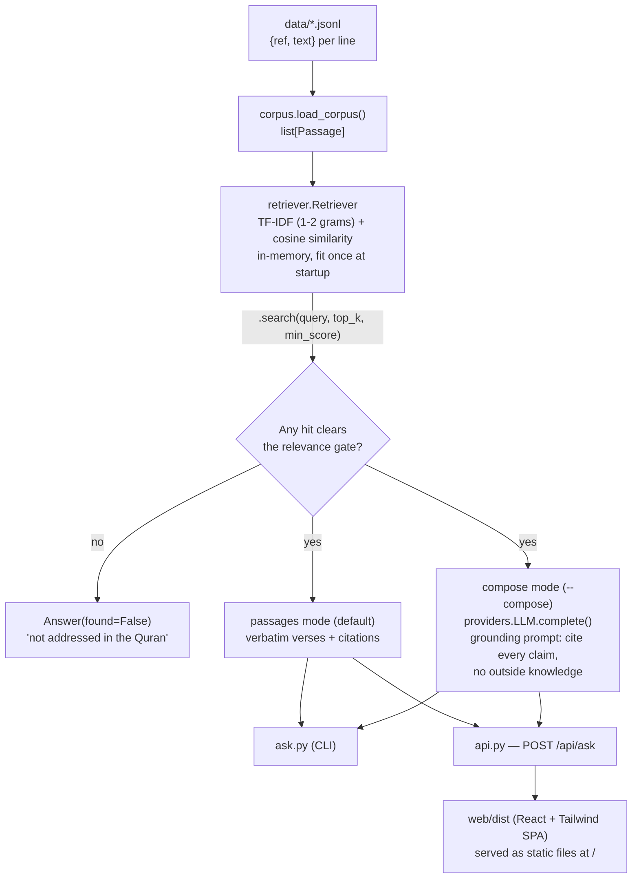

# Quran RAG

Answers questions strictly and only from the Quran, always with `[chapter:verse]` citations — and declines when a topic isn't in the text rather than guessing.


## What it does

Given a question, the system retrieves the most relevant verses from a corpus using TF-IDF + cosine similarity, then either:

- **returns the verses verbatim** with their `[chapter:verse]` citations (default, no LLM needed — by construction this is only the book's words), or
- **composes a prose answer** from those verses using an LLM, under a system prompt that forbids outside knowledge and requires a citation for every statement (`--compose`, optional).

A relevance gate sits in front of both modes: if no verse clears a similarity threshold, the system says the topic isn't addressed instead of forcing a weak match or inventing an answer. The test suite (`tests/test_quran_rag.py`) directly asserts this guarantee — citations must be verbatim substrings of the corpus, and off-topic questions must be declined.

The repo ships with a **10-verse sample corpus** (`data/quran_sample.jsonl`) so it runs out of the box; see [Add the full text](#add-the-full-text) to use it for real.

## Architecture



`providers.py` supplies two LLM backends behind a common interface: `MockLLM` (deterministic, used by tests — no network) and `AnthropicLLM` (real API call, default model `claude-opus-4-8`). Neither the retriever nor the answerer knows which one it's talking to.

There's no persisted vector index or database — the TF-IDF matrix is rebuilt from the JSONL file in-memory each time a process starts (CLI invocation or API startup). That's a deliberate tradeoff for a small, offline, dependency-light corpus; it would need revisiting for a full-length translation (6,000+ verses) served at scale.

## Quickstart

```bash
python -m venv .venv && source .venv/bin/activate   # Windows: .\.venv\Scripts\activate
pip install -e ".[dev]"

python ask.py "hardship and ease"
pytest -q   # 7 tests
```

Real output from the command above:

```
$ python ask.py "hardship and ease"
[94:6] Surely with that hardship comes more ease.

[94:5] So, surely with hardship comes ease.

Sources: 94:6, 94:5
```

```
$ python ask.py "how to configure a kubernetes cluster"
This topic does not appear to be addressed in the Quran.
```

Compose a grounded prose answer with an LLM (cites every verse):

```bash
pip install -e ".[anthropic]"
python ask.py "hardship and ease" --provider anthropic --api-key sk-ant-... --compose
# or: export ANTHROPIC_API_KEY=sk-ant-... and drop --api-key
```

### Web UI (React + Tailwind + FastAPI)

```bash
pip install -e ".[web]"
uvicorn api:app --reload          # open http://localhost:8000
```

The committed `web/dist` means `uvicorn api:app` works straight from a clone — no `npm install` required just to try it. To develop or rebuild the frontend:

```bash
cd web && npm install && npm run build   # outputs web/dist (served by the backend)
```

## Project structure

```
src/groundedrag/
├── corpus.py      # Passage dataclass + JSONL loader
├── retriever.py   # TF-IDF cosine retrieval + relevance gate (Retriever, Hit)
├── answer.py       # GroundedAnswerer: passages mode / LLM-compose mode
└── providers.py   # LLM interface: MockLLM (tests) + AnthropicLLM
ask.py             # CLI entry point (argparse)
api.py             # FastAPI backend; also serves web/dist as static files
data/quran_sample.jsonl   # 10-verse placeholder corpus — replace with the full text
web/                # React + Tailwind + Vite frontend (web/dist is the committed build)
tests/test_quran_rag.py   # 7 tests, including the grounding guarantees
```

## Key design decisions

- **TF-IDF over embeddings**: no model download, no GPU, runs offline in under a second. Appropriate for a small demo corpus; documented as a limitation below for larger corpora.
- **Relevance gate as a first-class outcome**: refusing to answer is not an error path here — it's the feature. Tests assert it directly rather than just checking retrieval returns *something*.
- **Passages mode needs no LLM**: the default mode is trivially grounded because the output literally *is* the source text. The LLM is strictly optional, used only to make the answer read as prose.
- **Provider abstraction**: `LLM` is a two-method interface (`complete`), so `MockLLM` can stand in for `AnthropicLLM` in tests with zero network calls and deterministic output.

## Limitations

- **Retrieval quality on longer/conversational queries**: TF-IDF on short documents can let an incidental word match dominate a genuinely relevant passage. For example, a query phrased as a full question containing the word "say" can outrank the actual on-topic verses, because a short verse containing "Say" concentrates its TF-IDF weight on that single token. Short, keyword-style queries (as in the Quickstart example) avoid this; longer natural-language questions may not always surface the best match first.
- **Sample corpus only**: `data/quran_sample.jsonl` has 10 verses for demonstration. Real use requires supplying a full translation (see below).
- **No persisted index**: the TF-IDF matrix rebuilds on every process start; fine at this scale, not designed for a large corpus served at production traffic.
- **No authentication or rate limiting** on the FastAPI backend, and CORS is fully open (`allow_origins=["*"]`) — appropriate for local/demo use, not for public deployment as-is.
- **Compose mode passes retrieved text into the LLM prompt un-sandboxed**: if you supply an untrusted or adversarial corpus file, injected text inside a "verse" could attempt to steer the LLM despite the grounding prompt. Low risk in normal use since you control your own corpus file, but worth knowing.

## Add the full text

Replace `data/quran_sample.jsonl` with the full translation you trust — one JSON object per line:

```json
{"ref": "2:255", "text": "Allah! There is no god but He, the Living ..."}
```

Point `ask.py --data` at your file, or overwrite the sample. No code changes needed; the system indexes whatever you provide.

## Roadmap

- Domain-aware stopword handling or a BM25 ranker to fix the retrieval-quality limitation above.
- Optional embedding-based retriever (behind an extra, like `anthropic`/`web`) for better ranking on a full-length translation.
- CI workflow running the test suite on push (currently only run locally).
- API/CLI-level test coverage (current tests cover the core engine and grounding guarantees, not the HTTP or CLI layers).

## Note on the text

Translations of the Quran vary; use the translation you and your community trust. The included sample uses widely-circulated public-domain English renderings purely as placeholder data to demonstrate the system. This is a study/search aid — it surfaces and cites verses; it is not a substitute for scholarship.

## License

MIT (code). The Quran text you supply is governed by its own translation's terms.
